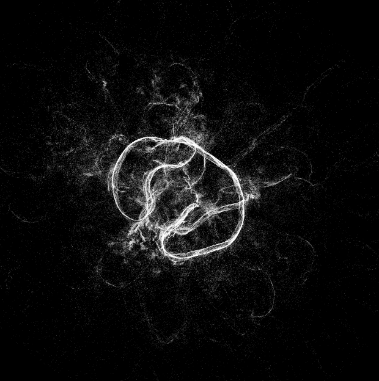
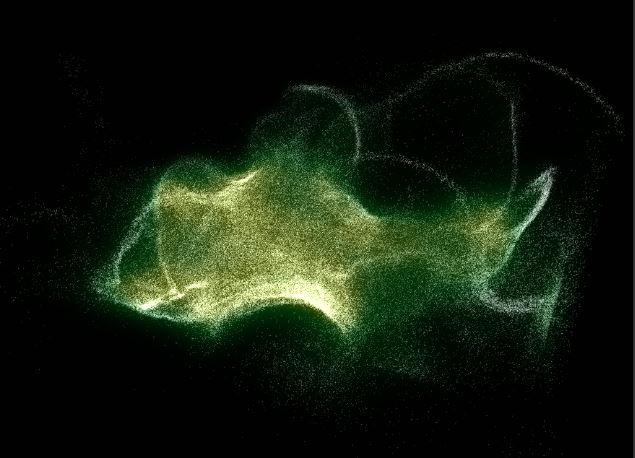

# Physarum(Unity Demo)
### Intro

This is a Unity Demo for the Physarum Simulation. Inspired by [Sage Jenson's Procedural Art](https://sagejenson.com/physarum), this project implemented the [evolution of Physarum networks](http://eprints.uwe.ac.uk/15260/1/artl.2010.16.2.pdf) by using some CG techniques including compute shader, GPU particles and 3D volume visulazation. A brief introduction will be presented as below.

### Algorithm

As the image upon, the simulation contains 6 step.

* Particle Related
1. SENSE: read the data from Trail map (Render Texture)
2. ROTATE: update the particle velocity
3. MOVE: update the particle position
* Trail Related
4. DEPOSIT: change the Trail value according to the distrubution of particle
5. DIFFUSE: 'Blur' the Trail map
6. DECAY: Reduce the Trail value 

### Data Structure

Particle : ComputeBuffer, a List of ParticleInfo(particle position + particle velocity)
Trail    : Render Texture * 3
           TrailRead/TrailWrite: two render texture for trail update 
           Deposit : an additional render texture used in deposit step

### Visualization
The GPU particle is used in 

### Optimization

### Reference
